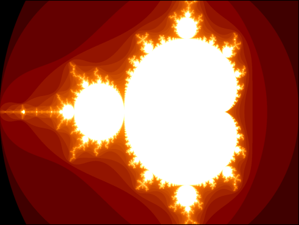

# Mandelbrot Set



## Description

This python code is simple test to generate a Mandelbrot set using pyCUDA. The CUDA kernel code is in seperate file.

## Environment

Miniconda environment is used to manage the python environment. The environment is created using the following command:

```bash
conda install pycuda
conda install cudatoolkit-dev
```

Note that the `cudatoolkit-dev` is used to install the CUDA toolkit. You need to have Visual Studio Build Tools 2019 installed to use this package.


## License

MIT License
